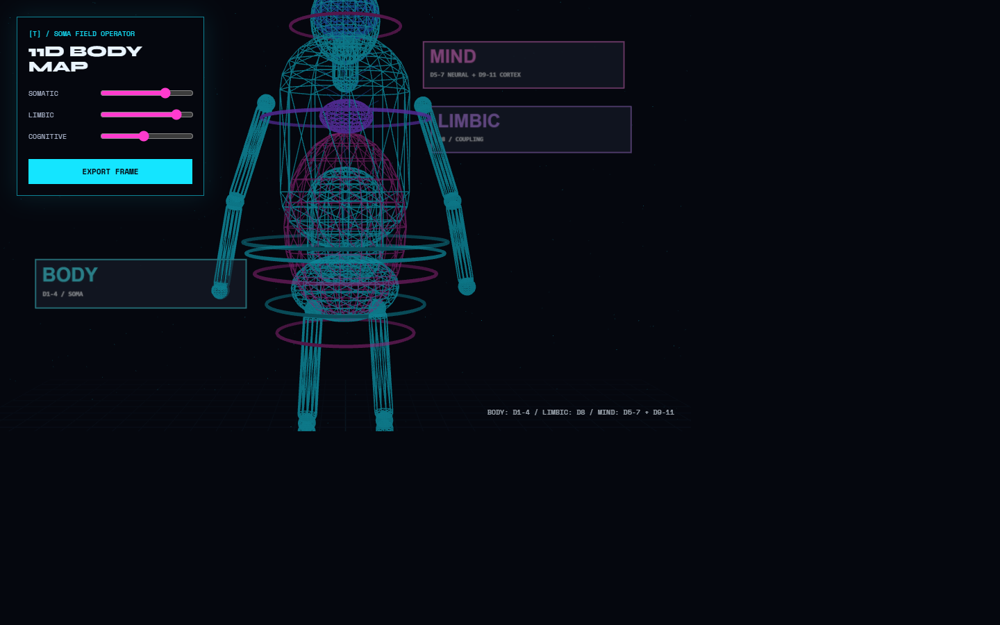

# [T]-Theory

**A science nested inside an art movement.**

*Universal Somatic Field · formal proof · quantum experiment · fractal programme · live field visualisation*

[OPEN THE SOMA FIELD OPERATOR](https://github.com/ITI-Theory/U/tree/main/apps/instrument/visuals/soma-field-operator)

---

## The Programme

**[T]-Theory** has two deliberate layers:

| Layer | Role |
|---|---|
| **Soma Field Theory** | The formal research engine: field dynamics, Lean 4 proofs, experiments, papers, and datasets. |
| **[T]-Theory** | The live cultural system: projection, music, body-scale field visualisation, and the Hologram World. |

The [Soma Field Operator](https://github.com/ITI-Theory/U/tree/main/apps/instrument/visuals/soma-field-operator) is the shared visual template: a human-shaped 11D field map where soma, nervous system, limbic coupling, and cortex become live controllable layers.

---

## Start Here

| If you are… | Read first |
|---|---|
| New, no technical background | [A Voyage into Trauma](https://github.com/ITI-Theory/Dist/blob/main/papers/soma-field-book.pdf) |
| Mental health professional | [A Voyage into Trauma](https://github.com/ITI-Theory/Dist/blob/main/papers/soma-field-book.pdf) → [The Soma Field](https://github.com/ITI-Theory/Dist/blob/main/papers/soma-field-paper.pdf) → [Physical Substrate](https://github.com/ITI-Theory/Dist/blob/main/papers/soma-physical-substrate.pdf) |
| Physicist / mathematician | [Research Programme](https://github.com/ITI-Theory/Dist/blob/main/papers/soma-field-synthesis.pdf) → [The Soma Field](https://github.com/ITI-Theory/Dist/blob/main/papers/soma-field-paper.pdf) → [Quantum](https://github.com/ITI-Theory/Dist/blob/main/papers/quantum-soma-penrose.pdf) |
| Want the scientific corpus | [Papers omnibus](https://github.com/ITI-Theory/Dist/blob/main/papers/omnibus-a4.pdf) |
| Want the 15-domain programme | [Fractal omnibus](https://github.com/ITI-Theory/Dist/blob/main/papers/ttheory-omnibus.pdf) |
| Want to query the work | [NotebookLM sources](https://github.com/ITI-Theory/Dist/tree/main/nlm-min) |

---

## Ask The Theory

The complete research programme is queryable via NotebookLM.

**Live notebook:** https://notebook.google.com/notebook/ec1a7e74-7666-40ff-acdf-e11baa95766b

Or load your own copy: download the two core sources from [`Dist/nlm-min/`](https://github.com/ITI-Theory/Dist/tree/main/nlm-min), or select the expanded corpus from [`Dist/nlm-max/`](https://github.com/ITI-Theory/Dist/tree/main/nlm-max).

**Example questions:**
- *"Why does trauma form faster than it heals, according to the field geometry?"*
- *"What is the QUANT-EXP-1 quantum annealing result?"*
- *"How does the USF prove the Osterwalder–Schrader axioms?"*
- *"What does the theory say about ADHD vs autism vs CPTSD?"*
- *"Explain the trauma-attractor phase transition."*

---

## Research Record

The current registry, open PDFs, NotebookLM packages, print candidates, and Zenodo deposit scope live in the distribution repository:

- [Read the papers](https://github.com/ITI-Theory/Dist/tree/main/papers)
- [Browse the master registry](https://github.com/ITI-Theory/Dist/blob/main/PAPERS.yaml)
- [Access the formal proofs](https://github.com/ITI-Theory/U/tree/main/paper/proofs)
- [Open the full research workspace](https://github.com/ITI-Theory/U)

---

## Fractal Programme

The same field equation applied to 15 academic disciplines — each with a domain introduction, curated papers, and a research agenda:

Physics · Neuroscience · Clinical Psychology · Computer Science · Formal Mathematics · Consciousness Studies · Complex Systems · Music & Arts · Geophysics · Social Science · Economics · Law · PPE · Psychiatry/ASD · Philosophy

Read the programme as one volume or explore its individual field domains through the [distribution library](https://github.com/ITI-Theory/Dist/tree/main/papers).

---

## Formal Verification

The core theorems are machine-checked in **Lean 4** with zero sorries and zero extra axioms:

- **Correspondence Principle** — FM-HN reduces to Hopfield 1982 at zero somatic stress
- **Causality** — the retarded propagator is causal (Temporal Dynamics paper)
- **OS Axioms** — free-field USF satisfies all 5 Osterwalder–Schrader axioms (P14, 2026)
  → The USF is the first emotional dynamics model proved to be a valid Euclidean QFT
- **BFSS Isomorphism** — structural identification with the matrix model
- **Scale Invariance** — proved for the full 20-level Zoom Operator hierarchy

Proof repository: [`ITI-Theory/U`](https://github.com/ITI-Theory/U) → `paper/proofs/`

---

## Print Editions

The print rehearsal set contains the Papers omnibus, [T]-Theory Volumes I and II, and all fifteen domain books. Current interiors and cover assets are maintained in [`Dist/lulu/`](https://github.com/ITI-Theory/Dist/tree/main/lulu).

---

## Supplementary Materials

Stickers, cheat sheet, and cover artwork: [`Dist/stuff/`](https://github.com/ITI-Theory/Dist/tree/main/stuff)

| Item | What it is |
|---|---|
| `ttheory-cheatsheet.pdf` | One-page mathematical reference card — master equation, propagator, OS axioms |
| `t-theory-sticker.png` | Die-cut sticker design (90 mm or 50 mm circle) |
| `soma-field-operator/` | Live 11D human field-map prototype and paper-frame exporter |

---

## Repositories

| Repo | Purpose |
|---|---|
| [`U`](https://github.com/ITI-Theory/U) | Main research repo — papers, Lean 4 proofs, quantum experiment |
| [`Dist`](https://github.com/ITI-Theory/Dist) | Distribution — all PDFs, print files, Zenodo runbook |
| [`T.Dot`](https://github.com/ITI-Theory/T.Dot) | HAL command router, device bootstrap |
| [`T.Ops`](https://github.com/ITI-Theory/T.Ops) | Standards, architecture docs |
| `T.Live` *(forthcoming)* | Live events, projection, music |

---

*Author: Alistair Johnson · ORCID [0009-0007-2194-0850](https://orcid.org/0009-0007-2194-0850) · Independent Researcher, Zurich*

